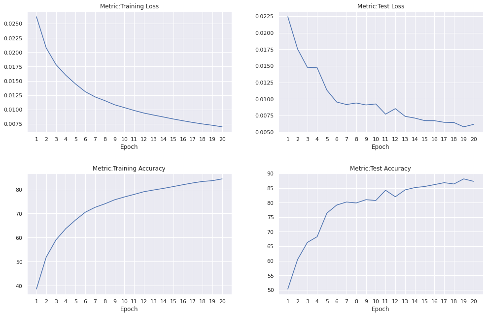

## Session 7: Advanced Training Concepts

In this assignment we are supposed to train a CIFAR10 dataset using Resnet18 architecture.
Also we need to show the layer activations using **gradcam**


## Files
I am making use of a code repository [StarterKit](https://github.com/TSAI-EVA8/StarterKit)

* The repo is first cloned in this project using 
```
git clone https://github.com/TSAI-EVA8/StarterKit
```

* The trainiing notebook is [Session7_Solution.ipynb](https://github.com/TSAI-EVA8/advancedTraining/blob/master/Session7_Solution.ipynb) which makes use of the code in the [StarterKit](https://github.com/TSAI-EVA8/StarterKit) to perform the training. All the logic is present in the [StarterKit](https://github.com/TSAI-EVA8/StarterKit)

## Transformations
I have used the following transformations
* transforms.RandomCrop(32,4)
* transforms.RandomRotation((-18.0, 18.0), fill=(1,))
* Cutout(n_holes=1, length=16) . The Cutout was implemented from scratch as it is not present in the torchvision.transforms

Following is a set of images after transformations (training images)


I have not applied any transformation on the testing imaages as shown below


## Training Configuration
1. Epoch : 20
2. Batch Size: 64

Used the SGD optimizer with LR=0.01 and momentum=0.9

## Results
After training for 20 epochs the model achieved a test accuracy of 87.3%

The test accuracy is better than the training accuracy (84.3%) which shows that the model is doing better on the test images as we had made the training task hard by adding all the transformations

Here are the training logs
Epoch 1:
Loss=1.97 Batch_ID=781 Train_Accuracy=38.64: 100%|██████████████████████████████████████████████████████████████████████████████████████████████████████████████████████████| 782/782 [00:35<00:00, 21.79it/s]
Test set: Average loss: 0.0224, Accuracy: 5027/10000 (50.27%)

Epoch 2:
Loss=1.60 Batch_ID=781 Train_Accuracy=51.88: 100%|██████████████████████████████████████████████████████████████████████████████████████████████████████████████████████████| 782/782 [00:36<00:00, 21.36it/s]
Test set: Average loss: 0.0175, Accuracy: 6042/10000 (60.42%)

Epoch 3:
Loss=1.57 Batch_ID=781 Train_Accuracy=59.07: 100%|██████████████████████████████████████████████████████████████████████████████████████████████████████████████████████████| 782/782 [00:37<00:00, 21.03it/s]
Test set: Average loss: 0.0148, Accuracy: 6629/10000 (66.29%)

Epoch 4:
Loss=1.46 Batch_ID=781 Train_Accuracy=63.71: 100%|██████████████████████████████████████████████████████████████████████████████████████████████████████████████████████████| 782/782 [00:37<00:00, 21.01it/s]
Test set: Average loss: 0.0147, Accuracy: 6826/10000 (68.26%)

Epoch 5:
Loss=1.74 Batch_ID=781 Train_Accuracy=67.31: 100%|██████████████████████████████████████████████████████████████████████████████████████████████████████████████████████████| 782/782 [00:37<00:00, 20.95it/s]
Test set: Average loss: 0.0113, Accuracy: 7637/10000 (76.37%)

Epoch 6:
Loss=1.20 Batch_ID=781 Train_Accuracy=70.55: 100%|██████████████████████████████████████████████████████████████████████████████████████████████████████████████████████████| 782/782 [00:37<00:00, 20.99it/s]
Test set: Average loss: 0.0095, Accuracy: 7914/10000 (79.14%)

Epoch 7:
Loss=1.01 Batch_ID=781 Train_Accuracy=72.58: 100%|██████████████████████████████████████████████████████████████████████████████████████████████████████████████████████████| 782/782 [00:37<00:00, 20.99it/s]
Test set: Average loss: 0.0092, Accuracy: 8018/10000 (80.18%)

Epoch 8:
Loss=0.54 Batch_ID=781 Train_Accuracy=74.03: 100%|██████████████████████████████████████████████████████████████████████████████████████████████████████████████████████████| 782/782 [00:37<00:00, 20.96it/s]
Test set: Average loss: 0.0094, Accuracy: 7986/10000 (79.86%)

Epoch 9:
Loss=0.89 Batch_ID=781 Train_Accuracy=75.71: 100%|██████████████████████████████████████████████████████████████████████████████████████████████████████████████████████████| 782/782 [00:37<00:00, 20.93it/s]
Test set: Average loss: 0.0091, Accuracy: 8099/10000 (80.99%)

Epoch 10:
Loss=0.50 Batch_ID=781 Train_Accuracy=76.89: 100%|██████████████████████████████████████████████████████████████████████████████████████████████████████████████████████████| 782/782 [00:37<00:00, 20.93it/s]
Test set: Average loss: 0.0092, Accuracy: 8071/10000 (80.71%)

Epoch 11:
Loss=0.56 Batch_ID=781 Train_Accuracy=77.96: 100%|██████████████████████████████████████████████████████████████████████████████████████████████████████████████████████████| 782/782 [00:37<00:00, 20.99it/s]
Test set: Average loss: 0.0077, Accuracy: 8424/10000 (84.24%)

Epoch 12:
Loss=0.34 Batch_ID=781 Train_Accuracy=79.07: 100%|██████████████████████████████████████████████████████████████████████████████████████████████████████████████████████████| 782/782 [00:37<00:00, 20.94it/s]
Test set: Average loss: 0.0085, Accuracy: 8199/10000 (81.99%)

Epoch 13:
Loss=0.46 Batch_ID=781 Train_Accuracy=79.78: 100%|██████████████████████████████████████████████████████████████████████████████████████████████████████████████████████████| 782/782 [00:37<00:00, 21.05it/s]
Test set: Average loss: 0.0074, Accuracy: 8436/10000 (84.36%)

Epoch 14:
Loss=0.15 Batch_ID=781 Train_Accuracy=80.45: 100%|██████████████████████████████████████████████████████████████████████████████████████████████████████████████████████████| 782/782 [00:37<00:00, 20.99it/s]
Test set: Average loss: 0.0071, Accuracy: 8515/10000 (85.15%)

Epoch 15:
Loss=0.99 Batch_ID=781 Train_Accuracy=81.20: 100%|██████████████████████████████████████████████████████████████████████████████████████████████████████████████████████████| 782/782 [00:37<00:00, 20.97it/s]
Test set: Average loss: 0.0067, Accuracy: 8553/10000 (85.53%)

Epoch 16:
Loss=0.30 Batch_ID=781 Train_Accuracy=81.98: 100%|██████████████████████████████████████████████████████████████████████████████████████████████████████████████████████████| 782/782 [00:37<00:00, 21.07it/s]
Test set: Average loss: 0.0067, Accuracy: 8617/10000 (86.17%)

Epoch 17:
Loss=0.24 Batch_ID=781 Train_Accuracy=82.71: 100%|██████████████████████████████████████████████████████████████████████████████████████████████████████████████████████████| 782/782 [00:37<00:00, 21.00it/s]
Test set: Average loss: 0.0065, Accuracy: 8684/10000 (86.84%)

Epoch 18:
Loss=0.38 Batch_ID=781 Train_Accuracy=83.33: 100%|██████████████████████████████████████████████████████████████████████████████████████████████████████████████████████████| 782/782 [00:37<00:00, 20.99it/s]
Test set: Average loss: 0.0064, Accuracy: 8639/10000 (86.39%)

Epoch 19:
Loss=0.80 Batch_ID=781 Train_Accuracy=83.65: 100%|██████████████████████████████████████████████████████████████████████████████████████████████████████████████████████████| 782/782 [00:37<00:00, 21.02it/s]
Test set: Average loss: 0.0058, Accuracy: 8814/10000 (88.14%)

Epoch 20:
Loss=0.72 Batch_ID=781 Train_Accuracy=84.39: 100%|██████████████████████████████████████████████████████████████████████████████████████████████████████████████████████████| 782/782 [00:37<00:00, 21.07it/s]
Test set: Average loss: 0.0062, Accuracy: 8730/10000 (87.30%)


Here are the plots for the Training and Testing



## GradCam
We used the gradcam algorithm to test out the what the model is looking at different layers. Here are few images 


## Misclassification & Class accuracy

Here are few of the misclassified images


The class level accuracy on the entire test data
```
Accuracy of plane : 84 %
Accuracy of   car : 94 %
Accuracy of  bird : 83 %
Accuracy of   cat : 78 %
Accuracy of  deer : 87 %
Accuracy of   dog : 79 %
Accuracy of  frog : 96 %
Accuracy of horse : 84 %
Accuracy of  ship : 94 %
Accuracy of truck : 91 %
```